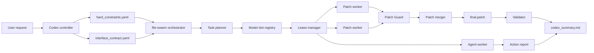

# file-swarm

Codex-controlled, OpenAI-compatible, file-level coding swarm.

中文定位：由 Codex 轻量主控的、OpenAI 兼容模型驱动的、文件级并行编程系统。

`file-swarm` is not another agent that blindly edits your repository. It is an orchestration layer:

```text
Codex defines rules.
Model workers return patches or structured actions.
file-swarm enforces leases, guards, summaries, and validation.
Codex decides whether to apply.
```

## What It Does

`file-swarm` now has two coordinated modes.

| Mode | Skill | Purpose | Output |
| --- | --- | --- | --- |
| Patch Swarm | `$file-swarm` | Split coding work into file-level guarded patch workers | `final.patch`, transcripts, guard reports, summary |
| Action Agent | `$file-swarm-agent` | Ask a model to plan typed shell/browser/mouse/MCP actions safely | action result summaries, dry-run benchmark reports |

The project is designed for OpenAI-compatible endpoints, local mock slots, and provider adapters such as OpenAI-compatible Chat Completions and Anthropic-style Messages APIs.

## Why It Exists

Direct AI coding is fast, but it can be hard to audit at scale.

`file-swarm` adds the missing control plane:

- explicit file ownership per task
- slot lease isolation
- model/task visibility
- Patch Guard before merge
- reproducible `final.patch`
- `codex_summary.md` for apply decisions
- optional agent action execution with dry-run safety

## Architecture



## Core Features

### Patch Swarm

- Uses `asyncio` dispatch with real global `--parallel N`.
- Leases model slots before worker start.
- Avoids reusing busy slots.
- Writes visible transcripts for every worker.
- Normalizes LLM patch output before guard/merge.
- Rejects unsafe or out-of-scope patches.
- Produces `final.patch` only from guard-passed patches.

### Agent Action Mode

`file-swarm-agent` extends the system beyond patch generation. It supports model-planned structured actions:

```text
shell
browser_open
browser_fetch
mouse_click
mouse_move
mouse_drag
key_type
key_press
key_hotkey
screenshot
mcp_call
wait
```

Use this mode for non-coding automation, diagnostics, dry-run computer control, and model action benchmarks. It is safety-first: destructive commands are blocked, secrets are filtered, output is capped, and benchmarks default to dry-run behavior.

### Provider Support

- `mock`: deterministic local testing
- `openai_compatible`: Chat Completions compatible endpoints
- `anthropic`: Anthropic-style Messages API endpoints

Provider failures return structured `ProviderResult` objects instead of raw uncaught exceptions.

## Installation

This package is currently installed from source, not PyPI:

```bash
git clone https://github.com/xianshengl487-star/file-swarm.git
cd file-swarm
python -m pip install -e .
```

Verify:

```bash
file-swarm --help
python -m pytest -q
```

Expected current test status:

```text
38 passed
```

## Quick Start

```bash
file-swarm init --repo .
file-swarm preflight --repo .
file-swarm codex-contract "Add a feature safely" --repo .
file-swarm auto "Add a feature safely" --repo . --parallel 3 --dry-merge
file-swarm summary --run <run_id> --for-codex
```

Apply only after reading the summary:

```bash
file-swarm apply --run <run_id> --allow-dirty
```

Repair rejected or failed work:

```bash
file-swarm repair --run <run_id>
```

## Live Provider Checks

Never write API keys into files. Use environment variables referenced by `api_key_env`.

```bash
file-swarm preflight --repo . --live
file-swarm smoke-test --repo . --live
```

Live smoke-test is strict: if the model does not return a real unified diff, the run fails. It does not fabricate a passing patch.

## Model Slot Configuration

Slots live in:

```text
.swarm/config/model_slots.yaml
```

Example:

```yaml
model_slots:
  - id: nvidia_glm
    provider: openai_compatible
    base_url: https://integrate.api.nvidia.com/v1
    api_key_env: NVIDIA_API_KEY_01
    enabled: true
    allowed_models:
      - z-ai/glm-5.1
    default_model: z-ai/glm-5.1
    max_concurrent_tasks: 1
```

Lease rules:

- a slot must be acquired before a worker starts
- busy slots are skipped
- `max_concurrent_tasks` is respected
- task completion, failure, and timeout release the lease

## Run Artifacts

Every run writes inspectable files under:

```text
.swarm/runs/<run_id>/
```

Important files:

| File | Purpose |
| --- | --- |
| `file_tasks.json` | planned file-level or agent tasks |
| `dispatch_report.json` | which slot/model/provider handled each task |
| `timeline.jsonl` | `slot_acquired`, `worker_started`, `worker_finished`, `slot_released` |
| `transcripts/*.input.md` | exact worker prompts |
| `transcripts/*.output.md` | exact model responses |
| `transcripts/*.meta.json` | token, provider, slot, model metadata |
| `guard_reports/*.guard.json` | Patch Guard result per task |
| `final.patch` | merged guarded patch |
| `codex_summary.md` | apply recommendation for Codex |

## Showing Which Model Did What

Read `dispatch_report.json` and report:

```text
task_id | file(s) | slot | model | provider | status
task_001 | src/orders.py | mock_alpha | mock-model | mock | passed
task_002 | src/pricing.py | nvidia_glm | z-ai/glm-5.1 | openai_compatible | passed
```

This is the core advantage over direct editing: the work is traceable.

## Medium Project Comparison

I ran a controlled medium-sized Python project comparison on June 27, 2026.

Task:

```text
Add a safe marker function to each FlowKit source module while preserving behavior and tests.
```

Project shape:

- 6 source modules
- 1 test module
- git-initialized project
- no real API keys

Results:

| Metric | file-swarm | Codex direct |
| --- | --- | --- |
| Source files changed | 6 | 6 |
| Tasks/work units | 6 file-level workers | 1 direct edit pass |
| Slots used | `mock_alpha`, `mock_beta`, `mock_gamma` | none |
| Models used | `mock-model` | none |
| Patch Guard | yes, per task | no |
| Transcripts | yes | no |
| Final patch artifact | yes | git diff only |
| Apply recommendation | `recommend_apply: yes` | not applicable |
| Test result | `1 passed` | `1 passed` |
| Measured edit/auto time | 1.23s auto orchestration | 0.01s direct edit |

Conclusion:

- `file-swarm` is better when auditability, parallel model assignment, safe patch gates, and reproducible reports matter.
- Direct Codex editing is faster for simple, trusted, local changes.
- The best workflow is hybrid: Codex defines constraints and decides; file-swarm handles parallel guarded work; Codex can still directly handle tiny or urgent edits.

Full report:

[docs/swarm-vs-codex-comparison.md](docs/swarm-vs-codex-comparison.md)

## Agent Dry-Run Result

I also ran an action-agent dry-run using the latest `$file-swarm-agent` contract.

| Metric | Result |
| --- | --- |
| Provider | fake local provider |
| Model | fake-action-model |
| Actions planned | 4 |
| Action types | `shell`, `mcp_call`, `mcp_call`, `browser_fetch` |
| Blocked actions | 0 |
| Mode | dry run |

This validates the action pipeline without executing real shell/browser side effects.

## Patch Guard

Patch Guard rejects:

- empty patches
- edits outside `allowed_files`
- `.env` and `.env.local`
- `package.json`
- `pyproject.toml`
- `requirements.txt`
- lockfiles
- absolute paths
- file deletions unless explicitly allowed
- suspected API keys or tokens

## Apply Safety

`file-swarm apply` checks:

- `final.patch` exists
- `final.patch` is non-empty
- guard reports passed
- rejected patches are not applied
- git worktree is clean unless `--allow-dirty`
- `before_apply.diff` is written
- validation runs unless `--no-validate`

Default apply path is `git apply`. Fallback apply requires explicit opt-in.

## Skills

Installable Codex skills are included:

```text
.claude/skills/file-swarm/SKILL.md
.claude/skills/file-swarm-agent/SKILL.md
```

Use them like:

```text
Use $file-swarm to split this coding task into guarded patch workers and report which model handled each file.
```

```text
Use $file-swarm-agent to run a dry-run structured action benchmark and summarize the safest model choices.
```

## Benchmark Notes

The included benchmark files are dry-run oriented and read keys only from environment variables:

```text
NVIDIA_API_KEY
NVIDIA_API_KEY_01
NVIDIA_API_KEY_02
MIMO_API_KEY
MIMO_API_KEY_01
```

No benchmark should require committing a real key.

Current benchmark report in this repository is environment-specific. It should not be read as a universal model ranking.

## Recommended Workflow

1. Use Codex to define the task and constraints.
2. Run `file-swarm preflight`.
3. Run `file-swarm auto --dry-merge`.
4. Inspect `dispatch_report.json` and `codex_summary.md`.
5. Apply only when the summary recommends it.
6. Run validation.
7. Use `repair` for failed or rejected tasks.

## When To Use file-swarm

Use it for:

- medium-to-large multi-file changes
- model comparison
- multi-provider coding experiments
- strict audit trails
- controlled patch-only workflows
- dry-run agent action testing

Prefer direct Codex editing for:

- tiny one-file edits
- fast local refactors with low risk
- tasks where orchestration overhead is not justified

## License

MIT
