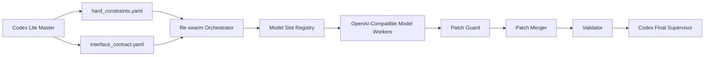

# file-swarm

Codex-controlled OpenAI-compatible file-level coding swarm.

`file-swarm` is a lightweight orchestration scaffold for delegating code work to OpenAI-compatible model workers while keeping Codex in a final-supervisor role.

## Project Goal

The project focuses on a small, disciplined parallel coding workflow:

- Codex generates hard constraints and interface contracts.
- File-swarm orchestrates planning, dispatch, guard checks, merging, validation, and summary.
- Model workers only return unified diff patches by default.
- Final application decisions stay under Codex control.

## Why Codex Does Less Work

`file-swarm` is designed so Codex does not directly modify repository files in the normal workflow.
Instead, downstream models produce unified diff patches, and the orchestrator decides whether a patch can be applied.

## Core Roles

### Codex Lite Master

The final supervisor that produces:

- `hard_constraints.yaml`
- `interface_contract.yaml`
- the final supervision decision

### Model Slot

A model slot is a single `base_url + api_key_env` configuration for one OpenAI-compatible provider endpoint.

### Model Worker

A worker is a runtime task executor bound to:

- a task
- a slot
- a model

### Stateless Patch Worker

The default worker type.
It does not directly write files and instead returns unified diff patches.

## OpenAI-compatible Model Support

The project is designed to work with any OpenAI-compatible Chat Completions API, including:

- DeepSeek
- GLM
- Qwen
- Kimi
- MiniMax
- Claude
- Gemini
- OpenAI-compatible proxies
- LiteLLM
- vLLM
- Ollama

Support is interface-first: this repository ships the contract and scaffolding, not real model calls.

## Core Workflow



## Safety Mechanisms

- visible transcripts
- slot preflight checks
- patch guard enforcement
- scope-limited file assignment
- secret redaction
- dry-merge default behavior

## Communication Visibility

All important orchestration steps are written to disk in transcript files so the workflow stays inspectable.

## Patch Guard

Patch Guard is the gatekeeper that checks:

- scope
- file assignment
- file creation rules
- secret redaction
- dependency restrictions

Only guarded patches can move toward merge and application.

## MVP Roadmap

1. Scaffold repository and CLI commands.
2. Add configuration samples and contract data models.
3. Implement slot registry and lease management.
4. Add patch guard and patch merger.
5. Add validation and summary reporting.
6. Grow toward real multi-worker orchestration.

## Installation

```bash
pip install -e .
```

## CLI

```bash
file-swarm init
file-swarm preflight
file-swarm codex-contract
file-swarm plan
file-swarm dispatch
file-swarm guard
file-swarm merge
file-swarm auto
file-swarm summary
file-swarm apply
```

Example workflow:

```bash
file-swarm init
file-swarm preflight
file-swarm codex-contract "实现登录模块"
file-swarm auto "实现登录模块" --repo . --parallel 8 --dry-merge
file-swarm summary --for-codex
file-swarm apply --run <run_id>
```

## Command Output Philosophy

Each command prints a clear planned-state message first, because this repository currently exposes the scaffold before the full orchestration engine.

## License

MIT
